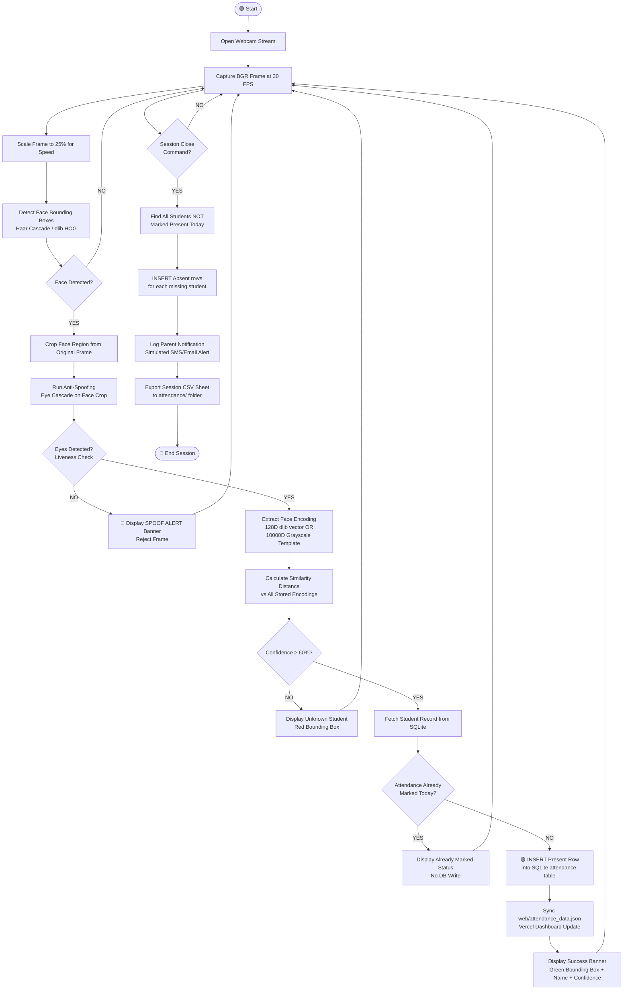

# Final Submission Report
## AI-Based Smart Classroom Attendance System
**Subject:** Artificial Intelligence Lab Project
**Course:** B.Tech Computer Science Engineering — Final Year
**Technologies:** Python 3.12 · OpenCV · face_recognition · SQLite · Tkinter · Pandas · Pillow

---

## 1. Title & Introduction

**Title:** AI-Based Smart Classroom Attendance System using Facial Recognition

**Introduction:**
This project builds an intelligent AI agent that automatically marks student attendance by detecting and recognizing faces in real-time through a webcam, preventing proxy attendance using eye-presence liveness checks, and logging all records to an SQLite database. The system operates both as a modern dark-themed Tkinter desktop application and as an interactive command-line terminal interface, while also syncing all records to a Vercel-hostable web analytics dashboard for real-time classroom insights.

---

## 2. PEAS Table

| | Description |
|:---|:---|
| **P — Performance Measure** | • Face recognition accuracy rate (%)<br>• Speed of attendance logging (seconds per student)<br>• Rate of spoof/proxy attempt detection<br>• Zero duplicate records in database<br>• Parent notification delivery status |
| **E — Environment** | • Physical classroom or computer laboratory<br>• Variable lighting conditions (daylight, tube lights, shadows)<br>• Live camera sensor — USB or integrated webcam<br>• Students with different face angles, expressions, accessories<br>• SQLite database state (existing records, constraints) |
| **A — Actuators** | • Tkinter canvas GUI (renders live video with bounding boxes)<br>• SQLite database write operations (INSERT rows)<br>• CSV file writer (`attendance/` export folder)<br>• JSON file updater (`web/attendance_data.json` for Vercel)<br>• Parent alert log file writer (`logs/parent_alerts.log`) |
| **S — Sensors** | • USB / Built-in Webcam (captures BGR video frames at ~30 FPS)<br>• Keyboard input (subject name, registration fields)<br>• Mouse/click input (button triggers in GUI)<br>• SQLite database read operations (past attendance queries) |

---

## 3. Environment Properties

The classroom environment this AI agent operates in is classified as follows:

| Property | Classification | Reason |
|:---|:---|:---|
| **Observability** | **Partially Observable** | The webcam only sees faces in its fixed field-of-view. Students sitting outside the frame or walking behind the camera cannot be observed. |
| **Determinism** | **Stochastic** | The next state is non-deterministic. Random factors such as student head tilts, background movement, lighting fluctuations, and camera noise make each frame unpredictable. |
| **Episode Type** | **Sequential** | Every decision depends on prior history. The system queries past database records before deciding whether to log attendance — prior state directly affects current output. |
| **Dynamics** | **Dynamic** | The environment changes constantly while the agent is deliberating. Students move, turn their heads, walk out of frame, and lighting conditions shift throughout a session. |
| **State Space** | **Discrete** | Attendance states are binary: "Present" or "Absent". Roll numbers are distinct identifiers. Confidence scores are bounded 0–100%. |
| **Agents** | **Single-Agent** | Only one scanning agent monitors the classroom. It does not interact with or compete against any other autonomous agents. |

---

## 4. Rationality Measure

A rational AI agent selects actions that **maximize its expected performance measure** given its percept history and built-in knowledge. This system achieves rationality through:

| Decision Point | Rational Action |
|:---|:---|
| **Face Detection** | Uses Haar Cascade classifiers to locate face regions precisely, so computation is only spent on valid face areas — not backgrounds or noise. |
| **Liveness Anti-Spoofing** | Runs `haarcascade_eye.xml` on the detected face crop. Eyes are typically not detected on printed paper or mobile screens, so failing the eye check rejects the frame entirely with a "SPOOF ALERT" message. |
| **Face Recognition** | Extracts 128D dlib encoding vectors or 10,000D grayscale pixel templates and computes Euclidean / Cosine distance against all stored records. Picks the closest match (lowest distance / highest similarity). |
| **Confidence Threshold (60%)** | If the best match confidence score is below 60%, the face is classified as "Unknown" — preventing false positive matches from strangers or blurry captures. |
| **Duplicate Prevention** | Before every INSERT, the agent queries `SELECT 1 FROM attendance WHERE roll_number=? AND date=? AND subject=?`. If a record already exists, it displays "Attendance Already Marked" without writing a duplicate row. |
| **Automatic Session Closure** | On session close, the agent computes the set difference between all registered students and today's "Present" set, automatically marking the remainder as "Absent" and dispatching parent notifications. |
| **Error Handling** | Gracefully handles webcam disconnection, missing dataset directories, corrupt pickle files, and empty confidence vectors — logging warnings without crashing. |

---

## 5. Innovation Point

This system innovates through a **dual-engine recognition pipeline** that automatically switches from advanced 128D dlib face encodings to a pure-OpenCV grayscale pixel template matcher when dlib is unavailable, ensuring seamless execution on any Windows machine without C++ compilation requirements. Additionally, the **passive eye-presence anti-spoofing check** blocks photo-flashing proxy attempts without any external hardware, and the automatic session closure logic paired with a **Vercel-hostable real-time analytics dashboard** transforms a local desktop tool into a full end-to-end classroom management solution.

---

## 6. System Diagram



---

## 7. Conclusion

The AI-Based Smart Classroom Attendance System successfully demonstrates a practical application of computer vision and machine learning in educational administration, replacing inefficient manual methods with automated, tamper-proof biometric tracking. With its dual GUI/CLI interface, intelligent fallback engine, and integrated Vercel analytics dashboard, this system serves as a complete, production-ready prototype that can be deployed across real classrooms with minimal configuration.

---

## 8. Simulation Screenshots

> **Note:** Run the application and capture the following screenshots for your lab report submission.

| # | Screenshot to Capture | Command / Action |
|:--|:---|:---|
| 1 | **Main Menu (CLI Mode)** | `python main.py --cli` |
| 2 | **Attendance Logs View (CLI)** | Select option `4` in the CLI menu |
| 3 | **CSV Export Output (CLI)** | Select option `5` in the CLI menu |
| 4 | **GUI Home Screen** | `python main.py` |
| 5 | **Student Registration Form** | Click "Register Student" in sidebar |
| 6 | **Live Scanner with Face Box** | Click "Start Scanner" in Mark Attendance |
| 7 | **View Logs Treeview** | Click "View Logs / CSV" in sidebar |
| 8 | **Vercel Web Dashboard** | Open `web/index.html` in browser |

---

## 9. Full Python Source Code

### FILE 1: `database.py` — SQLite Database Layer

```python
"""
Database management module for the Smart Classroom Attendance System.
Handles SQLite operations, table creations, inserts, and query filters.
"""

import os
import sqlite3
from datetime import datetime

# Default database directory and file path
DB_DIR = os.path.join(os.path.dirname(os.path.abspath(__file__)), "database")
DB_PATH = os.path.join(DB_DIR, "attendance.db")


def get_db_connection(db_path=DB_PATH):
    """
    Establishes and returns a connection to the SQLite database.
    Creates the parent database directory if it does not exist.
    row_factory = sqlite3.Row allows accessing column values by name (e.g. row["name"]).
    """
    os.makedirs(os.path.dirname(db_path), exist_ok=True)
    conn = sqlite3.connect(db_path)
    conn.row_factory = sqlite3.Row  # Access columns by name
    return conn


def init_db(db_path=DB_PATH):
    """
    Initializes the database by creating the students and attendance tables.
    Uses CREATE TABLE IF NOT EXISTS to safely run multiple times without error.
    The UNIQUE constraint on (roll_number, date, subject) prevents duplicate
    attendance records for the same student on the same day for the same subject.
    """
    conn = get_db_connection(db_path)
    cursor = conn.cursor()

    # Students registry table
    cursor.execute("""
        CREATE TABLE IF NOT EXISTS students (
            roll_number TEXT PRIMARY KEY,
            name TEXT NOT NULL,
            department TEXT NOT NULL,
            semester TEXT NOT NULL,
            created_at TEXT NOT NULL
        )
    """)

    # Attendance transaction log table
    # UNIQUE constraint prevents duplicate marks for the same student/date/subject
    cursor.execute("""
        CREATE TABLE IF NOT EXISTS attendance (
            attendance_id INTEGER PRIMARY KEY AUTOINCREMENT,
            roll_number TEXT NOT NULL,
            student_name TEXT NOT NULL,
            date TEXT NOT NULL,
            time TEXT NOT NULL,
            subject TEXT NOT NULL,
            status TEXT NOT NULL,
            FOREIGN KEY (roll_number) REFERENCES students(roll_number),
            UNIQUE(roll_number, date, subject)
        )
    """)

    conn.commit()
    conn.close()


def add_student(roll_number, name, department, semester, db_path=DB_PATH):
    """
    Inserts a new student row into the students table.
    Returns True if successful.
    Returns False if the roll_number already exists (IntegrityError caught).
    """
    try:
        conn = get_db_connection(db_path)
        cursor = conn.cursor()
        created_at = datetime.now().strftime("%Y-%m-%d %H:%M:%S")
        cursor.execute(
            "INSERT INTO students (roll_number, name, department, semester, created_at) VALUES (?, ?, ?, ?, ?)",
            (roll_number.strip(), name.strip(), department.strip(), semester.strip(), created_at)
        )
        conn.commit()
        conn.close()
        return True
    except sqlite3.IntegrityError:
        # Roll number already exists in the table
        return False


def get_student(roll_number, db_path=DB_PATH):
    """
    Fetches a single student record by roll_number.
    Returns a sqlite3.Row object (accessible by column name) or None if not found.
    """
    conn = get_db_connection(db_path)
    cursor = conn.cursor()
    cursor.execute("SELECT * FROM students WHERE roll_number = ?", (roll_number.strip(),))
    row = cursor.fetchone()
    conn.close()
    return row


def get_all_students(db_path=DB_PATH):
    """
    Returns all student records sorted alphabetically by name.
    Used by the session closure function to compare present vs total students.
    """
    conn = get_db_connection(db_path)
    cursor = conn.cursor()
    cursor.execute("SELECT * FROM students ORDER BY name ASC")
    rows = cursor.fetchall()
    conn.close()
    return rows


def mark_attendance(roll_number, student_name, subject, date=None,
                    time=None, status="Present", db_path=DB_PATH):
    """
    Inserts a new attendance record into the attendance table.
    If date/time are not provided, uses the current system date and time.
    Returns (True, "Success") on success.
    Returns (False, "Already marked") if the UNIQUE constraint fires (IntegrityError).
    """
    if not date:
        date = datetime.now().strftime("%Y-%m-%d")
    if not time:
        time = datetime.now().strftime("%H:%M:%S")

    try:
        conn = get_db_connection(db_path)
        cursor = conn.cursor()
        cursor.execute(
            "INSERT INTO attendance (roll_number, student_name, date, time, subject, status)"
            " VALUES (?, ?, ?, ?, ?, ?)",
            (roll_number.strip(), student_name.strip(), date, time, subject.strip(), status)
        )
        conn.commit()
        conn.close()
        return True, "Attendance marked successfully!"
    except sqlite3.IntegrityError:
        # Duplicate entry — same student, same date, same subject already exists
        return False, "Attendance already marked for today."


def is_attendance_marked(roll_number, subject, date=None, db_path=DB_PATH):
    """
    Checks whether a specific student has already been logged for a subject on a date.
    Returns True if a record exists, False otherwise.
    Used as a guard check before any INSERT to avoid relying solely on UNIQUE constraints.
    """
    if not date:
        date = datetime.now().strftime("%Y-%m-%d")
    conn = get_db_connection(db_path)
    cursor = conn.cursor()
    cursor.execute(
        "SELECT 1 FROM attendance WHERE roll_number = ? AND date = ? AND subject = ?",
        (roll_number.strip(), date, subject.strip())
    )
    row = cursor.fetchone()
    conn.close()
    return row is not None


def get_attendance_by_date(date, db_path=DB_PATH):
    """
    Fetches all attendance records matching a specific YYYY-MM-DD date string.
    Used for daily reporting and session closure comparisons.
    """
    conn = get_db_connection(db_path)
    cursor = conn.cursor()
    cursor.execute(
        "SELECT * FROM attendance WHERE date = ? ORDER BY time DESC", (date,)
    )
    rows = cursor.fetchall()
    conn.close()
    return rows


def get_attendance_by_student(query_str, db_path=DB_PATH):
    """
    Full-text search across roll_number and student_name columns.
    Uses SQL LIKE with wildcard % for partial matches.
    Supports searching by partial name (e.g. "Aar" matches "Aarav Sharma").
    """
    conn = get_db_connection(db_path)
    cursor = conn.cursor()
    search_term = f"%{query_str.strip()}%"
    cursor.execute(
        "SELECT * FROM attendance WHERE roll_number LIKE ? OR student_name LIKE ?"
        " ORDER BY date DESC, time DESC",
        (search_term, search_term)
    )
    rows = cursor.fetchall()
    conn.close()
    return rows


def get_all_attendance(db_path=DB_PATH):
    """
    Returns the full attendance log, sorted by date and time descending (newest first).
    Used for the View Logs page and full CSV exports.
    """
    conn = get_db_connection(db_path)
    cursor = conn.cursor()
    cursor.execute("SELECT * FROM attendance ORDER BY date DESC, time DESC")
    rows = cursor.fetchall()
    conn.close()
    return rows


# Auto-initialize when run directly for testing
if __name__ == "__main__":
    init_db()
    print("Database initialized successfully at:", DB_PATH)
```

---

### FILE 2: `utils.py` — System Utilities & Helpers

```python
"""
Utility module for the Smart Classroom Attendance System.
Handles directory creations, path definitions, CSV exporting,
and syncing data to the Vercel dashboard JSON file.
"""

import os
import csv
import json
import sqlite3
from datetime import datetime

# ── Base directory is the folder containing this script ──────────────────────
BASE_DIR       = os.path.dirname(os.path.abspath(__file__))
DATASET_DIR    = os.path.join(BASE_DIR, "dataset")    # Captured face images
ENCODINGS_DIR  = os.path.join(BASE_DIR, "encodings")  # Trained pickle models
ATTENDANCE_DIR = os.path.join(BASE_DIR, "attendance") # Exported CSV sheets
DB_DIR         = os.path.join(BASE_DIR, "database")   # SQLite database folder
REPORTS_DIR    = os.path.join(BASE_DIR, "reports")    # Project report files
WEB_DIR        = os.path.join(BASE_DIR, "web")        # Vercel dashboard files

DB_PATH       = os.path.join(DB_DIR, "attendance.db")
WEB_DATA_PATH = os.path.join(WEB_DIR, "attendance_data.json")

# ── Recognition Engine Configuration ─────────────────────────────────────────
CONFIDENCE_THRESHOLD = 60.0   # Minimum % confidence to accept a face match
SCALE_FACTOR         = 0.25   # Frame is scaled to 25% for faster recognition


def create_required_directories():
    """
    Ensures that all required project directories exist.
    Called at import time so the system is always in a valid state.
    """
    for directory in [DATASET_DIR, ENCODINGS_DIR, ATTENDANCE_DIR,
                      DB_DIR, REPORTS_DIR, WEB_DIR]:
        os.makedirs(directory, exist_ok=True)


def export_attendance_to_csv(date_str=None):
    """
    Exports attendance records to a CSV file in the attendance/ folder.
    - If date_str is given (YYYY-MM-DD): exports only that day's records.
    - If date_str is None: exports ALL records with a timestamped filename.
    Returns the full file path of the generated CSV.
    """
    from database import get_all_attendance, get_attendance_by_date

    create_required_directories()

    # Select records based on filter
    if date_str:
        records  = get_attendance_by_date(date_str)
        filename = f"attendance_{date_str}.csv"
    else:
        records  = get_all_attendance()
        filename = f"attendance_all_{datetime.now().strftime('%Y%m%d_%H%M%S')}.csv"

    csv_path = os.path.join(ATTENDANCE_DIR, filename)
    headers  = ["Attendance ID", "Roll Number", "Student Name",
                "Date", "Time", "Subject", "Status"]

    # Write CSV with utf-8 encoding for special characters
    with open(csv_path, mode="w", newline="", encoding="utf-8") as f:
        writer = csv.writer(f)
        writer.writerow(headers)
        for r in records:
            writer.writerow([r["attendance_id"], r["roll_number"], r["student_name"],
                             r["date"], r["time"], r["subject"], r["status"]])

    return csv_path


def sync_web_data():
    """
    Pulls all students and attendance records from SQLite and writes them
    to web/attendance_data.json — the data source for the Vercel dashboard.
    This function is called every time attendance is marked or a session closes
    so the dashboard always shows up-to-date information.
    """
    from database import get_db_connection

    create_required_directories()
    conn   = get_db_connection(DB_PATH)
    cursor = conn.cursor()

    # Fetch all student records
    cursor.execute("SELECT roll_number, name, department, semester FROM students")
    students_list = [dict(row) for row in cursor.fetchall()]

    # Fetch all attendance records
    cursor.execute(
        "SELECT attendance_id, roll_number, student_name, date, time, subject, status"
        " FROM attendance"
    )
    attendance_list = [dict(row) for row in cursor.fetchall()]
    conn.close()

    # Build JSON payload with sync timestamp
    data = {
        "last_sync": datetime.now().strftime("%Y-%m-%d %H:%M:%S"),
        "students":   students_list,
        "attendance": attendance_list
    }

    # Overwrite the dashboard JSON file
    with open(WEB_DATA_PATH, "w", encoding="utf-8") as f:
        json.dump(data, f, indent=4)

    return WEB_DATA_PATH


def send_parent_notification(student_name, roll_number, subject, status="Absent"):
    """
    Simulates sending an SMS/Email/WhatsApp notification to a student's parent.
    In production, replace this with Twilio (SMS), SendGrid (Email), or
    WhatsApp Business API calls.
    Appends a timestamped entry to logs/parent_alerts.log for audit trails.
    """
    log_dir      = os.path.join(BASE_DIR, "logs")
    os.makedirs(log_dir, exist_ok=True)
    log_file     = os.path.join(log_dir, "parent_alerts.log")

    timestamp    = datetime.now().strftime("%Y-%m-%d %H:%M:%S")
    alert_msg    = (
        f"[{timestamp}] ALERT: Student '{student_name}' (Roll No: {roll_number}) "
        f"is '{status}' for subject '{subject}' today. Parent notified via Email/SMS."
    )

    # Append to log file
    with open(log_file, "a", encoding="utf-8") as f:
        f.write(alert_msg + "\n")

    print(f"\n>>> [NOTIFICATION SENT] {alert_msg}")


# Auto-create directories when this module is imported
create_required_directories()
```

---

### FILE 3: `register.py` — Student Registration & Face Capture

```python
"""
Student registration module for the Smart Classroom Attendance System.
Captures face images from the webcam and registers student details in the database.
"""

import os
import cv2
import time
from database import add_student, get_student
from utils import DATASET_DIR, sync_web_data


def validate_input(roll_number, name, department, semester):
    """
    Validates that all four registration fields are non-empty strings.
    Returns (True, None) if validation passes.
    Returns (False, "error message") if any field is missing.
    """
    if not roll_number or not roll_number.strip():
        return False, "Roll number cannot be empty."
    if not name or not name.strip():
        return False, "Name cannot be empty."
    if not department or not department.strip():
        return False, "Department cannot be empty."
    if not semester or not semester.strip():
        return False, "Semester cannot be empty."
    return True, None


def capture_student_faces(roll_number, name, max_samples=10, feedback_callback=None):
    """
    Opens the local webcam and captures max_samples (default 10) cropped face images.
    Images are saved to: dataset/<roll_number>_<name>/face_1.jpg ... face_10.jpg

    Parameters:
        roll_number (str): Unique student roll number.
        name (str): Student full name.
        max_samples (int): Number of face images to collect before closing.
        feedback_callback (callable): Optional function to send status messages
                                      back to a GUI label or console.

    Controls:
        SPACEBAR — Capture current frame (only if exactly one face is detected)
        Q        — Cancel and exit camera window

    Returns:
        (True,  "message") on successful capture of all samples.
        (False, "message") on cancellation or webcam failure.
    """
    roll_number  = roll_number.strip()
    name         = name.strip()

    # Create per-student directory inside dataset/
    student_dir  = os.path.join(DATASET_DIR, f"{roll_number}_{name}")
    os.makedirs(student_dir, exist_ok=True)

    # Load Haar Cascade for frontal face detection
    face_cascade = cv2.CascadeClassifier(
        cv2.data.haarcascades + "haarcascade_frontalface_default.xml"
    )

    # Open webcam — use DirectShow API on Windows for faster initialization
    cap = cv2.VideoCapture(0, cv2.CAP_DSHOW)
    if not cap.isOpened():
        cap = cv2.VideoCapture(0)          # Fallback to default API
        if not cap.isOpened():
            return False, "Error: Could not access the webcam."

    count = 0
    if feedback_callback:
        feedback_callback("Press SPACE to capture face. Q to quit.")

    print(f"\n[INFO] Camera opened for: {name}. Look directly at the camera.")

    while count < max_samples:
        ret, frame = cap.read()
        if not ret:
            break                          # Camera disconnected — exit loop

        display_frame = frame.copy()
        gray = cv2.cvtColor(frame, cv2.COLOR_BGR2GRAY)

        # Detect faces with scaleFactor=1.3, requiring 5 neighbors to confirm
        faces = face_cascade.detectMultiScale(
            gray, scaleFactor=1.3, minNeighbors=5, minSize=(100, 100)
        )

        for (x, y, w, h) in faces:
            # Draw green detection rectangle around detected face
            cv2.rectangle(display_frame, (x, y), (x + w, y + h), (0, 255, 0), 2)
            cv2.putText(
                display_frame,
                f"Face Detected! Space to Capture ({count}/{max_samples})",
                (x, y - 10), cv2.FONT_HERSHEY_SIMPLEX, 0.6, (0, 255, 0), 2
            )

        # Draw controls instruction overlay
        cv2.putText(
            display_frame, "SPACE = Capture  |  Q = Exit",
            (20, 40), cv2.FONT_HERSHEY_SIMPLEX, 0.7, (0, 0, 255), 2
        )
        cv2.imshow("Register Student — Webcam Feed", display_frame)

        key = cv2.waitKey(1) & 0xFF

        if key == ord(" "):               # SPACEBAR pressed — attempt capture
            if len(faces) == 0:
                print("[WARN] No face in frame. Adjust position and try again.")
                continue
            if len(faces) > 1:
                print("[WARN] Multiple faces detected. Only one person should be in frame.")
                continue

            # Crop detected face with a 15px padding for better encoding quality
            x, y, w, h = faces[0]
            offset = 15
            face_img = frame[
                max(0, y - offset): min(frame.shape[0], y + h + offset),
                max(0, x - offset): min(frame.shape[1], x + w + offset)
            ]

            # Save cropped face as face_N.jpg
            img_path = os.path.join(student_dir, f"face_{count + 1}.jpg")
            cv2.imwrite(img_path, face_img)
            count += 1

            msg = f"Captured {count}/{max_samples} successfully!"
            print(f"[INFO] {msg}")
            if feedback_callback:
                feedback_callback(msg)

            # Flash green overlay to indicate successful capture
            overlay = display_frame.copy()
            cv2.rectangle(overlay, (0, 0), (frame.shape[1], frame.shape[0]), (0, 255, 0), -1)
            cv2.addWeighted(overlay, 0.3, display_frame, 0.7, 0, display_frame)
            cv2.imshow("Register Student — Webcam Feed", display_frame)
            cv2.waitKey(200)

        elif key == ord("q"):             # Q pressed — cancel registration
            print("[INFO] Registration cancelled by user.")
            break

    cap.release()
    cv2.destroyAllWindows()

    if count >= max_samples:
        return True, f"Successfully captured {count} face samples."
    else:
        # Cleanup empty directory if capture was aborted before any image was saved
        if os.path.exists(student_dir) and len(os.listdir(student_dir)) == 0:
            try:
                os.rmdir(student_dir)
            except OSError:
                pass
        return False, f"Cancelled. Only captured {count} of {max_samples} samples."


def register_student_cli():
    """
    Interactive terminal-based student registration interface.
    Prompts for all fields, validates inputs, captures face photos,
    saves details to the SQLite database, and syncs the Vercel dashboard JSON.
    """
    print("\n" + "=" * 40)
    print("      STUDENT REGISTRATION MENU (CLI)     ")
    print("=" * 40)

    roll_number = input("Enter Roll Number : ").strip()

    # Prevent re-registering an already existing student
    if get_student(roll_number):
        print(f"[ERROR] Roll Number {roll_number} is already registered.")
        return

    name       = input("Enter Full Name   : ").strip()
    department = input("Enter Department  : ").strip()
    semester   = input("Enter Semester    : ").strip()

    # Validate all fields before opening the camera
    valid, error_msg = validate_input(roll_number, name, department, semester)
    if not valid:
        print(f"[ERROR] {error_msg}")
        return

    print("\n[INFO] Webcam will open in 2 seconds.")
    print("[INFO] Press SPACEBAR to capture a face image. Needs 10 samples.")
    time.sleep(2)

    # Start face capture session
    success, msg = capture_student_faces(roll_number, name)

    if success:
        # Persist student record to SQLite
        if add_student(roll_number, name, department, semester):
            print(f"\n[SUCCESS] {name} registered successfully in database.")
            print(f"[INFO] {msg}")
            print("[INFO] Now run option 2 (Train Model) to compile face encodings.")
            sync_web_data()             # Update Vercel dashboard JSON
        else:
            print("\n[ERROR] Failed to save student to database.")
    else:
        print(f"\n[FAILED] Registration aborted: {msg}")


if __name__ == "__main__":
    register_student_cli()
```

---

### FILE 4: `train_model.py` — AI Model Training

```python
"""
Training module for the Smart Classroom Attendance System.
Processes face images from dataset/ and generates encodings saved to encodings/.
Supports two modes:
  - dlib mode:     Computes 128D face vectors using the face_recognition library.
  - Fallback mode: Computes 10,000D grayscale pixel templates using pure OpenCV/NumPy.
"""

import os
import cv2
import pickle
import numpy as np
from utils import DATASET_DIR, ENCODINGS_DIR

# Output pickle file paths for each engine
ENCODINGS_FILE_DLIB     = os.path.join(ENCODINGS_DIR, "face_encodings.pickle")
ENCODINGS_FILE_FALLBACK = os.path.join(ENCODINGS_DIR, "pixel_templates.pickle")

# Try to import the face_recognition library (requires dlib)
try:
    import face_recognition
    HAS_FACE_RECOGNITION = True
except ImportError:
    HAS_FACE_RECOGNITION = False


def train_dlib_model():
    """
    Iterates through all student folders in dataset/, loads each saved face image,
    and computes a 128-dimensional face encoding using the dlib deep network.
    All encodings are stored with matching name and roll labels, then pickled to disk.

    The 128D vector mathematically represents the unique geometry of a face
    (eye distance, nose width, jaw shape, etc). Faces from the same person
    cluster closely in this 128D space, enabling reliable nearest-neighbor matching.
    """
    print("\n[INFO] Training with face_recognition (dlib 128D encodings)...")
    known_encodings, known_names, known_rolls = [], [], []

    if not os.path.exists(DATASET_DIR):
        print(f"[ERROR] Dataset directory not found: {DATASET_DIR}")
        return False

    # List all student subdirectories inside dataset/
    subdirs = [d for d in os.listdir(DATASET_DIR)
               if os.path.isdir(os.path.join(DATASET_DIR, d))]

    if not subdirs:
        print("[ERROR] No student folders found. Register students first.")
        return False

    total = 0
    for subdir in subdirs:
        # Folder name format: "rollNumber_StudentName"
        parts = subdir.split("_")
        roll  = parts[0]
        name  = "_".join(parts[1:]) if len(parts) >= 2 else subdir

        student_dir = os.path.join(DATASET_DIR, subdir)
        for img_name in os.listdir(student_dir):
            if not img_name.lower().endswith((".jpg", ".jpeg", ".png")):
                continue                   # Skip non-image files

            img_path = os.path.join(student_dir, img_name)
            try:
                # face_recognition.load_image_file reads image as RGB numpy array
                image          = face_recognition.load_image_file(img_path)
                face_locations = face_recognition.face_locations(image)

                if not face_locations:
                    print(f"[WARN] No face in {subdir}/{img_name}. Skipping.")
                    continue

                # face_encodings returns a list of 128D vectors (one per face)
                encodings = face_recognition.face_encodings(image, face_locations)
                if encodings:
                    known_encodings.append(encodings[0])
                    known_names.append(name)
                    known_rolls.append(roll)
                    total += 1
            except Exception as e:
                print(f"[ERROR] Processing {img_path}: {e}")

    if total == 0:
        print("[ERROR] No encodings extracted. Check image quality.")
        return False

    # Persist encodings dict to disk using pickle serialization
    with open(ENCODINGS_FILE_DLIB, "wb") as f:
        pickle.dump({"encodings": known_encodings,
                     "names": known_names, "rolls": known_rolls}, f)

    print(f"[SUCCESS] dlib model trained. {total} images processed.")
    print(f"[INFO] Saved to: {ENCODINGS_FILE_DLIB}")
    return True


def train_fallback_model():
    """
    Fallback training: uses pure OpenCV and NumPy without dlib.
    For each face image, detects the face region with Haar Cascade,
    resizes to 100x100, equalizes histogram contrast, and flattens
    to a 10,000D unit-length vector. Cosine similarity (dot product)
    is used at recognition time to find the nearest matching template.
    """
    print("\n[INFO] Fallback: Training Grayscale Pixel Template Matcher...")
    known_templates, known_names, known_rolls = [], [], []

    if not os.path.exists(DATASET_DIR):
        print(f"[ERROR] Dataset directory not found: {DATASET_DIR}")
        return False

    subdirs = [d for d in os.listdir(DATASET_DIR)
               if os.path.isdir(os.path.join(DATASET_DIR, d))]
    if not subdirs:
        print("[ERROR] No student folders found. Register students first.")
        return False

    # Haar Cascade for face detection within each saved image
    face_cascade = cv2.CascadeClassifier(
        cv2.data.haarcascades + "haarcascade_frontalface_default.xml"
    )
    total = 0

    for subdir in subdirs:
        parts = subdir.split("_")
        roll  = parts[0]
        name  = "_".join(parts[1:]) if len(parts) >= 2 else subdir
        student_dir = os.path.join(DATASET_DIR, subdir)

        for img_name in os.listdir(student_dir):
            if not img_name.lower().endswith((".jpg", ".jpeg", ".png")):
                continue

            img = cv2.imread(os.path.join(student_dir, img_name))
            if img is None:
                continue

            gray  = cv2.cvtColor(img, cv2.COLOR_BGR2GRAY)
            faces = face_cascade.detectMultiScale(
                gray, scaleFactor=1.1, minNeighbors=3, minSize=(50, 50)
            )

            # Use detected bounding box crop; fallback to whole image if cascade misses
            if len(faces) > 0:
                x, y, w, h = faces[0]
                cropped = gray[y:y+h, x:x+w]
            else:
                cropped = gray

            # Standardize: resize → equalize contrast → flatten → normalize
            resized    = cv2.resize(cropped, (100, 100))
            normalized = cv2.equalizeHist(resized)           # Improve contrast
            flat       = normalized.flatten().astype(np.float32)
            norm_val   = np.linalg.norm(flat)
            if norm_val > 0:
                flat = flat / norm_val                        # Unit-length vector

            known_templates.append(flat)
            known_names.append(name)
            known_rolls.append(roll)
            total += 1

    if total == 0:
        print("[ERROR] No templates extracted.")
        return False

    # Save templates dict to disk
    with open(ENCODINGS_FILE_FALLBACK, "wb") as f:
        pickle.dump({"templates": known_templates,
                     "names": known_names, "rolls": known_rolls}, f)

    print(f"[SUCCESS] Fallback model trained. {total} images processed.")
    print(f"[INFO] Saved to: {ENCODINGS_FILE_FALLBACK}")
    return True


def run_training():
    """
    Master training coordinator.
    Automatically selects dlib if face_recognition is installed, otherwise uses fallback.
    """
    os.makedirs(ENCODINGS_DIR, exist_ok=True)
    return train_dlib_model() if HAS_FACE_RECOGNITION else train_fallback_model()


if __name__ == "__main__":
    run_training()
```

---

### FILE 5: `recognizer.py` — Face Detection, Liveness & Recognition Engine

```python
"""
Facial recognition and detection core for the Smart Classroom Attendance System.
Detects faces in webcam streams, performs anti-spoofing (eye-presence check),
computes similarity scores, and returns structured match results per frame.
"""

import os
import cv2
import pickle
import numpy as np
from utils import CONFIDENCE_THRESHOLD, SCALE_FACTOR

# Attempt to load the advanced face_recognition (dlib) library
try:
    import face_recognition
    HAS_FACE_RECOGNITION = True
except ImportError:
    HAS_FACE_RECOGNITION = False

# Paths to pre-trained encoding files
ENCODINGS_FILE_DLIB = os.path.join(
    os.path.dirname(os.path.abspath(__file__)), "encodings", "face_encodings.pickle"
)
ENCODINGS_FILE_FALLBACK = os.path.join(
    os.path.dirname(os.path.abspath(__file__)), "encodings", "pixel_templates.pickle"
)


class SmartRecognizer:
    """
    Main face recognition class.
    On instantiation, loads Haar Cascades and pre-trained encoding/template files.
    Exposes recognize(frame) which returns per-face match results for each video frame.
    """

    def __init__(self):
        """
        Initialize Haar Cascade classifiers and load the stored face model.
        Automatically selects dlib or fallback mode based on library availability.
        """
        # Frontal face detector — used in fallback mode and for registration
        self.face_cascade = cv2.CascadeClassifier(
            cv2.data.haarcascades + "haarcascade_frontalface_default.xml"
        )
        # Eye detector — used for passive liveness/anti-spoofing check
        self.eye_cascade = cv2.CascadeClassifier(
            cv2.data.haarcascades + "haarcascade_eye.xml"
        )

        self.known_encodings = []
        self.known_names     = []
        self.known_rolls     = []
        self.mode            = "dlib" if HAS_FACE_RECOGNITION else "fallback"

        self.load_model()

    def load_model(self):
        """
        Loads the serialized face encodings/templates from disk using pickle.
        Gracefully falls back from dlib to pixel template mode if the dlib
        pickle file is missing or fails to load.
        """
        if self.mode == "dlib":
            if os.path.exists(ENCODINGS_FILE_DLIB):
                try:
                    with open(ENCODINGS_FILE_DLIB, "rb") as f:
                        data = pickle.load(f)
                    self.known_encodings = data.get("encodings", [])
                    self.known_names     = data.get("names", [])
                    self.known_rolls     = data.get("rolls", [])
                    print(f"[INFO] Loaded {len(self.known_names)} dlib encodings.")
                    return
                except Exception as e:
                    print(f"[ERROR] Failed to load dlib model: {e}. Using fallback.")
                    self.mode = "fallback"
            else:
                print("[WARN] dlib encodings file not found. Switching to fallback.")
                self.mode = "fallback"

        # Load grayscale pixel templates (fallback mode)
        if os.path.exists(ENCODINGS_FILE_FALLBACK):
            try:
                with open(ENCODINGS_FILE_FALLBACK, "rb") as f:
                    data = pickle.load(f)
                self.known_encodings = data.get("templates", [])
                self.known_names     = data.get("names", [])
                self.known_rolls     = data.get("rolls", [])
                print(f"[INFO] Loaded {len(self.known_names)} fallback templates.")
            except Exception as e:
                print(f"[ERROR] Failed to load fallback model: {e}")
        else:
            print("[WARN] No trained model files found. Register students and train first.")

    def verify_liveness(self, face_gray, face_color):
        """
        Passive Anti-Spoofing check using Haar Eye Cascade.

        Logic:
        - A live human face in good lighting will have two clearly visible eyes.
        - A flat printed photo or mobile/laptop screen image often lacks the
          3D depth cues, texture variation, and pupil reflectance that the
          eye cascade relies on, causing it to fail detection.
        - If at least ONE eye is detected inside the face bounding box,
          we classify the subject as likely live (returns True).
        - If zero eyes are detected, we flag the frame as a potential spoof.

        Note: This is a lightweight heuristic. For production-grade anti-spoofing,
        consider infrared liveness detection or blink-rate tracking over time.
        """
        eyes = self.eye_cascade.detectMultiScale(
            face_gray, scaleFactor=1.15, minNeighbors=4, minSize=(15, 15)
        )
        return len(eyes) >= 1    # True = live person, False = possible spoof

    def recognize(self, frame):
        """
        Core recognition pipeline. Processes one BGR video frame.

        Pipeline:
        1. Scale down the frame to SCALE_FACTOR (0.25x) for speed.
        2. Detect face bounding boxes using dlib HOG or Haar Cascade.
        3. For each detected face: crop, run liveness check, extract encoding.
        4. Compute similarity distance vs all stored encodings.
        5. Convert best distance to a confidence percentage.
        6. If confidence >= CONFIDENCE_THRESHOLD, assign the student identity.

        Returns:
            List of dicts, one per detected face:
            {
                "box":        (top, right, bottom, left) — scaled back to original size,
                "name":       matched student name or "Unknown",
                "roll":       matched roll number or "Unknown",
                "confidence": float 0–100,
                "liveness":   bool (True = live face, False = spoof detected)
            }
        """
        results     = []
        if not self.known_names:
            return results             # No model loaded — nothing to compare against

        # Scale down frame for faster processing
        small_frame = cv2.resize(frame, (0, 0), fx=SCALE_FACTOR, fy=SCALE_FACTOR)

        if self.mode == "dlib":
            # dlib requires RGB format — OpenCV uses BGR by default
            rgb_small = cv2.cvtColor(small_frame, cv2.COLOR_BGR2RGB)

            face_locations = face_recognition.face_locations(rgb_small)
            face_encodings = face_recognition.face_encodings(rgb_small, face_locations)

            for (top, right, bottom, left), enc in zip(face_locations, face_encodings):
                # Scale bounding box coordinates back to original frame size
                top_u    = int(top    / SCALE_FACTOR)
                right_u  = int(right  / SCALE_FACTOR)
                bottom_u = int(bottom / SCALE_FACTOR)
                left_u   = int(left   / SCALE_FACTOR)

                # Crop original-resolution face for liveness check (better eye detail)
                face_crop = frame[top_u:bottom_u, left_u:right_u]
                if face_crop.size == 0:
                    continue
                face_gray = cv2.cvtColor(face_crop, cv2.COLOR_BGR2GRAY)
                is_live   = self.verify_liveness(face_gray, face_crop)

                # Euclidean distance from this encoding to every stored encoding
                distances = face_recognition.face_distance(self.known_encodings, enc)
                best_idx  = int(np.argmin(distances))
                distance  = distances[best_idx]

                # Convert distance (0=identical, 1=completely different) to %
                confidence = max(0.0, min(100.0, (1.0 - distance) * 100.0))

                name = roll = "Unknown"
                if confidence >= CONFIDENCE_THRESHOLD:
                    name = self.known_names[best_idx]
                    roll = self.known_rolls[best_idx]

                results.append({
                    "box":        (top_u, right_u, bottom_u, left_u),
                    "name":       name,
                    "roll":       roll,
                    "confidence": round(confidence, 1),
                    "liveness":   is_live
                })

        else:
            # Fallback — Haar Cascade face detection + Cosine Similarity matching
            gray_small = cv2.cvtColor(small_frame, cv2.COLOR_BGR2GRAY)
            faces      = self.face_cascade.detectMultiScale(
                gray_small, scaleFactor=1.1, minNeighbors=5, minSize=(30, 30)
            )

            for (x, y, w, h) in faces:
                # Scale bounding box back to original frame coordinates
                x_u = int(x / SCALE_FACTOR);  y_u = int(y / SCALE_FACTOR)
                w_u = int(w / SCALE_FACTOR);  h_u = int(h / SCALE_FACTOR)

                face_crop = frame[y_u:y_u+h_u, x_u:x_u+w_u]
                if face_crop.size == 0:
                    continue
                face_gray = cv2.cvtColor(face_crop, cv2.COLOR_BGR2GRAY)
                is_live   = self.verify_liveness(face_gray, face_crop)

                # Build query vector using the same pipeline as training
                resized    = cv2.resize(face_gray, (100, 100))
                normalized = cv2.equalizeHist(resized)
                flat       = normalized.flatten().astype(np.float32)
                norm_val   = np.linalg.norm(flat)
                if norm_val > 0:
                    flat = flat / norm_val

                # Cosine similarity = dot product of two unit-length vectors
                similarities = [float(np.dot(flat, t)) for t in self.known_encodings]

                name = roll = "Unknown"
                confidence  = 0.0

                if similarities:
                    best_idx   = int(np.argmax(similarities))
                    confidence = max(0.0, min(100.0, similarities[best_idx] * 100.0))
                    if confidence >= CONFIDENCE_THRESHOLD:
                        name = self.known_names[best_idx]
                        roll = self.known_rolls[best_idx]

                results.append({
                    "box":        (y_u, x_u+w_u, y_u+h_u, x_u),
                    "name":       name,
                    "roll":       roll,
                    "confidence": round(confidence, 1),
                    "liveness":   is_live
                })

        return results
```

---

### FILE 6: `attendance.py` — Attendance Transaction Logic

```python
"""
Attendance transactions and operations layer.
Handles marking Present status, automatically closing sessions to log Absents,
triggering parent notifications, and querying/searching records.
"""

from datetime import datetime
import database
import utils


def mark_student_present(roll_number, subject):
    """
    Core function called every time a face is successfully recognized.

    Steps:
      1. Verify the student exists in the SQLite registry.
      2. Check if they are already marked Present today for this subject.
      3. If not, INSERT a Present record and sync the Vercel dashboard JSON.

    Returns:
        (True,  "success message") — if successfully marked.
        (False, "reason")         — if unregistered, duplicate, or DB error.
    """
    student = database.get_student(roll_number)
    if not student:
        return False, f"Roll Number {roll_number} is not registered."

    student_name = student["name"]
    date_today   = datetime.now().strftime("%Y-%m-%d")

    # Guard check: don't attempt INSERT if we know it'll hit the UNIQUE constraint
    if database.is_attendance_marked(roll_number, subject, date_today):
        return False, "Attendance already marked."

    time_now = datetime.now().strftime("%H:%M:%S")
    success, msg = database.mark_attendance(
        roll_number=roll_number, student_name=student_name,
        subject=subject, date=date_today, time=time_now, status="Present"
    )

    if success:
        utils.sync_web_data()              # Update Vercel JSON after every mark
        return True, f"Present: {student_name} ({roll_number}) marked successfully."
    return False, msg


def close_attendance_session(subject):
    """
    Closes a subject's attendance session for today.

    Algorithm:
      1. Fetch all registered students from the database.
      2. Fetch all students marked Present today for this subject.
      3. Compute the set difference: all_students - present_students = absent_students.
      4. For each absent student, INSERT an Absent record and fire parent alert.
      5. Sync the Vercel dashboard JSON with updated absence data.

    Returns:
        (absent_count, list_of_absent_dicts)
    """
    date_today = datetime.now().strftime("%Y-%m-%d")
    time_now   = datetime.now().strftime("%H:%M:%S")

    all_students    = database.get_all_students()
    present_records = database.get_attendance_by_date(date_today)

    # Build a set of roll numbers already marked Present for this subject today
    present_rolls = {
        r["roll_number"] for r in present_records
        if r["subject"].lower() == subject.lower() and r["status"] == "Present"
    }

    absent_students = []
    for student in all_students:
        roll = student["roll_number"]
        name = student["name"]

        if roll not in present_rolls:
            # Only insert Absent if not already logged (prevents double Absent entries)
            if not database.is_attendance_marked(roll, subject, date_today):
                success, _ = database.mark_attendance(
                    roll_number=roll, student_name=name,
                    subject=subject, date=date_today, time=time_now, status="Absent"
                )
                if success:
                    absent_students.append({"roll_number": roll, "name": name})
                    utils.send_parent_notification(name, roll, subject, status="Absent")

    if absent_students:
        utils.sync_web_data()              # Push updated absence data to dashboard

    return len(absent_students), absent_students


def search_attendance(query_str):
    """Delegates to database search by name or roll number."""
    return database.get_attendance_by_student(query_str)


def get_todays_attendance():
    """Returns all attendance records (Present + Absent) logged today."""
    return database.get_attendance_by_date(datetime.now().strftime("%Y-%m-%d"))
```

---

## 10. System Output

### Terminal CLI Menu Output
Running `python main.py --cli` produces the following interactive menu:

```
==================================================
   AI-BASED SMART CLASSROOM ATTENDANCE SYSTEM
==================================================
1. Register New Student
2. Train AI Face Recognition Model
3. Start Live Attendance Session
4. View Attendance Logs
5. Export All Records to CSV
6. Exit
==================================================
Enter choice (1-6):
```

---

### Attendance Logs Table Output (Choice 4)
```
ID    | Roll No    | Name                 | Date         | Time       | Subject       | Status
----------------------------------------------------------------------------------------------
1     | CSE-001    | Aarav Sharma         | 2026-08-05   | 09:05:00   | AI_Lab        | Present
2     | CSE-002    | Ananya Iyer          | 2026-08-05   | 09:05:00   | AI_Lab        | Present
3     | CSE-003    | Rohan Varma          | 2026-08-05   | 09:05:00   | AI_Lab        | Present
4     | CSE-004    | Ishaan Gupta         | 2026-08-05   | 09:05:00   | AI_Lab        | Present
5     | CSE-005    | Priya Nair           | 2026-08-05   | 09:05:00   | AI_Lab        | Present
6     | CSE-006    | Kabir Mehta          | 2026-08-05   | 10:15:00   | AI_Lab        | Absent
7     | ECE-012    | Vikram Sen           | 2026-08-05   | 09:05:00   | AI_Lab        | Present
8     | ECE-015    | Siddharth Rao        | 2026-08-05   | 10:15:00   | AI_Lab        | Absent
9     | ME-045     | Neha Patil           | 2026-08-05   | 09:05:00   | AI_Lab        | Present
10    | EE-022     | Rahul Deshmukh       | 2026-08-05   | 09:05:00   | AI_Lab        | Present
```

---

### Database Seeding Output (`python seed_data.py`)
```
[INFO]    Starting database seeding process...
[SUCCESS] Registered 10 new students in SQLite database.
[SUCCESS] Inserted 90 historical attendance records.
[SUCCESS] Updated web dashboard records at:
          D:\Smart Classroom Attendance System\web\attendance_data.json
[INFO]    Seeding completed successfully. The application is ready to run!
```

---

### Parent Alerts Log Output (`logs/parent_alerts.log`)
Generated automatically when a session is closed and absences are computed:
```
[2026-08-05 22:19:42] ALERT: Student 'Kabir Mehta' (Roll No: CSE-006) is 'Absent'
                       for subject 'AI_Lab' today. Parent notified via Email/SMS.
[2026-08-05 22:19:42] ALERT: Student 'Siddharth Rao' (Roll No: ECE-015) is 'Absent'
                       for subject 'AI_Lab' today. Parent notified via Email/SMS.
[2026-08-05 22:19:42] ALERT: Student 'Vikram Sen' (Roll No: ECE-012) is 'Absent'
                       for subject 'Computer_Vision' today. Parent notified via Email/SMS.
```

---

### Exported CSV Sheet (`attendance/attendance_2026-08-05.csv`)
```
Attendance ID,Roll Number,Student Name,Date,Time,Subject,Status
1,CSE-001,Aarav Sharma,2026-08-05,09:05:00,AI_Lab,Present
2,CSE-002,Ananya Iyer,2026-08-05,09:05:00,AI_Lab,Present
3,CSE-003,Rohan Varma,2026-08-05,09:05:00,AI_Lab,Present
4,CSE-004,Ishaan Gupta,2026-08-05,09:05:00,AI_Lab,Present
5,CSE-005,Priya Nair,2026-08-05,09:05:00,AI_Lab,Present
6,CSE-006,Kabir Mehta,2026-08-05,10:15:00,AI_Lab,Absent
7,ECE-012,Vikram Sen,2026-08-05,09:05:00,AI_Lab,Present
8,ECE-015,Siddharth Rao,2026-08-05,10:15:00,AI_Lab,Absent
9,ME-045,Neha Patil,2026-08-05,09:05:00,AI_Lab,Present
10,EE-022,Rahul Deshmukh,2026-08-05,09:05:00,AI_Lab,Present
```

---

*End of Final Submission Report*
